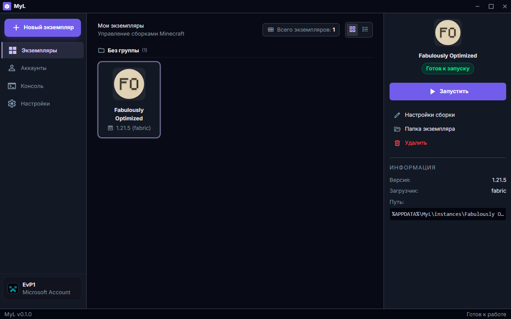
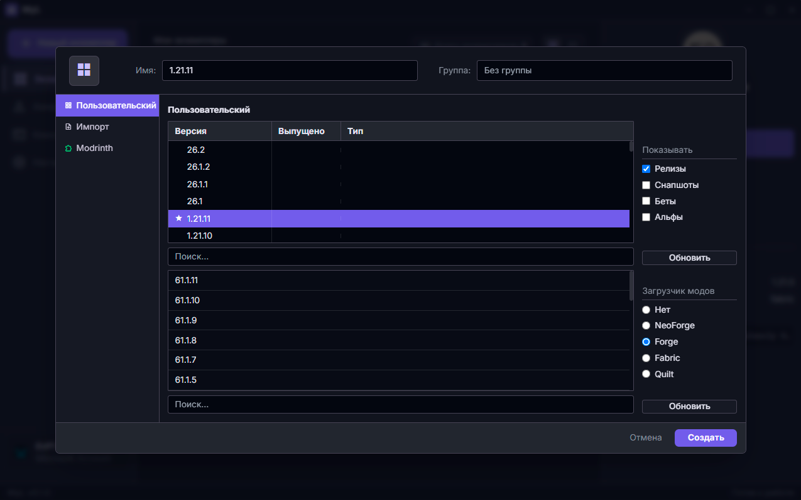

<div align="center">

# 🚀 MyL Launcher

**Modern, ultra-fast and high-performance Minecraft launcher built with Tauri 2.0 & Rust**

[](https://tauri.app)
[](https://www.rust-lang.org)
[](https://tailwindcss.com)
[](LICENSE)

[ 🇬🇧 English ](#-english) | [ 🇷🇺 Русский ](#-русский)

---



</div>

<br/>

## 🇬🇧 English

### ✨ Key Features

- ⚡ **Ultra Low Memory Footprint**: Blazing fast startup thanks to Rust + Lightweight HTML5/CSS UI (Tauri v2).
- 🌐 **Full Bilingual Support**: Switch effortlessly between English and Russian in settings.
- 🎨 **Custom Theme Presets**:
  - **Prism Dark** — Stylish default dark theme with purple accents.
  - **Cloud White** — Clean and bright minimal design.
  - **Midnight Onyx** — Deep contrast theme with graphite surfaces.
  - **Ember Flow** — Warm dark theme with fiery orange accents.
- 📐 **Flexible UI Density & Typography**:
  - *Compact*, *Normal*, and *Spacious* layout density for any display size.
  - Smooth micropixel font slider with 144 FPS V-Sync optimization.
- 🔑 **Account Management**:
  - Instant authentication via **Microsoft Account** (Device Code PKCE).
  - Support for offline custom usernames.
- 📦 **Built-in Mod Manager & Modrinth Integration**:
  - Direct search and one-click installation of modpacks and mods from **Modrinth**.
  - Quick toggle to enable/disable `.jar` mod files.
  - Mod loader support: **Vanilla, Fabric, Forge, NeoForge, Quilt**.
- 🎮 **Instance & Resource Management**:
  - Custom RAM allocation settings per instance or globally.
  - Dedicated managers for Resource Packs, Shader Packs, and Saved Worlds.
- 📜 **Real-time Game Console**:
  - Real-time output streaming and log filtering for running Minecraft processes with autoscroll.

---

### 📸 Screenshots

<div align="center">

#### Main Instances Screen


#### New Instance Wizard


</div>

---

### 🛠️ Building from Source

#### Prerequisites

1. **Rust Toolchain**: [Install Rust](https://www.rust-lang.org/tools/install)
2. **Node.js** (v18 or newer): [Install Node.js](https://nodejs.org)

#### Step-by-Step Instructions

1. **Clone the repository**:
   ```bash
   git clone https://github.com/YOUR_USERNAME/MyL.git
   cd MyL
   ```

2. **Start development mode**:
   ```bash
   npx @tauri-apps/cli dev
   ```

3. **Build production bundle and installers (`.exe` / `.msi`)**:
   ```bash
   npx @tauri-apps/cli build
   ```

Executable installers will be located at:
`src-tauri/target/release/bundle/nsis/MyL_0.1.0_x64-setup.exe`

---

<br/>

## 🇷🇺 Русский

### ✨ Ключевые Особенности

- ⚡ **Низкое потребление ресурсов**: Быстрый запуск благодаря связке Rust + Lightweight HTML5/CSS UI (Tauri v2).
- 🌐 **Двуязычный интерфейс**: Мгновенное переключение между Русским и Английским языками в настройках.
- 🎨 **Кастомные Темы Оформления**:
  - **Prism Dark** — стильная тёмная тема по умолчанию.
  - **Cloud White** — чистый и светлый минималистичный дизайн.
  - **Midnight Onyx** — глубокая контрастная тема с графитовыми подложками.
  - **Ember Flow** — тёплая темная тема с огненными акцентами.
- 📐 **Гибкая плотность интерфейса (Text Density)**:
  - *Компактная*, *Обычная* и *Просторная* компоновки под любой монитор.
  - Плавный микропиксельный ползунок размера шрифта со 144 FPS V-Sync оптимизацией.
- 🔑 **Поддержка Аккаунтов**:
  - Мгновенная авторизация через **Microsoft Account** (Device Code PKCE).
  - Поддержка автономных **Офлайн** записей.
- 📦 **Встроенный менеджер модов и сборки**:
  - Прямой поиск и установка модов и модпаков с платформы **Modrinth**.
  - Быстрое включение/отключение файлов `.jar` тумблерами.
  - Поддержка загрузчиков: **Vanilla, Fabric, Forge, NeoForge, Quilt**.
- 🎮 **Управление экземплярами**:
  - Кастомное выделение оперативной памяти (ОЗУ / RAM) под каждый процесс.
  - Управление Наборами ресурсов (Resourcepacks), Шейдерами (Shaders) и Мирами (Worlds).
- 📜 **Консоль в реальном времени**:
  - Чтение и фильтрация логов процессов Minecraft с автоскроллом и очисткой.

---

### 🛠️ Сборка из исходного кода

#### Предварительные требования

1. **Rust Toolchain**: [Установить Rust](https://www.rust-lang.org/tools/install)
2. **Node.js** (v18 или новее): [Установить Node.js](https://nodejs.org)

#### Инструкция по шагам

1. **Клонируйте репозиторий**:
   ```bash
   git clone https://github.com/EvP113/MyL.git
   cd MyL
   ```

2. **Запустите режим разработки**:
   ```bash
   npx @tauri-apps/cli dev
   ```

3. **Сборка готового релиза и инсталлятора (`.exe` / `.msi`)**:
   ```bash
   npx @tauri-apps/cli build
   ```

Готовые инсталляторы будут скомпилированы в папку:
`src-tauri/target/release/bundle/nsis/MyL_0.1.0_x64-setup.exe`

---

## 📄 License / Лицензия

Distributed under the MIT License. See `LICENSE` for more information.  
Распространяется под лицензией MIT. Смотрите `LICENSE` для получения дополнительной информации.
