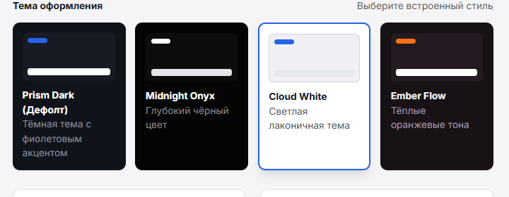
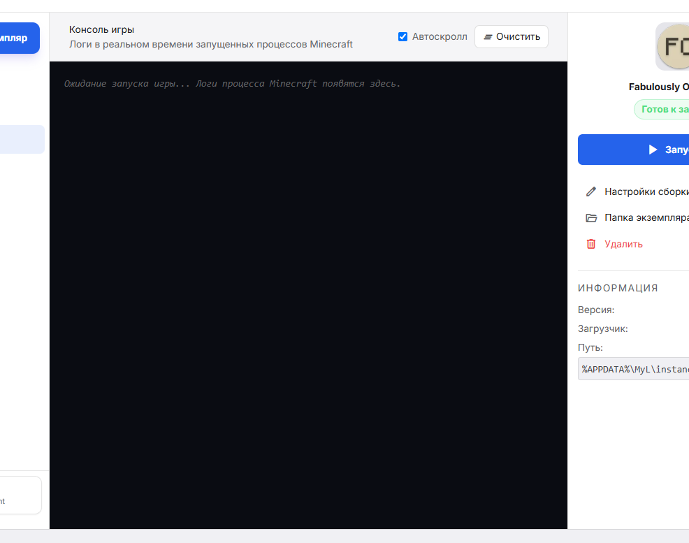

<div align="center">

# 🚀 MyL Launcher

**Современный, быструщий и высокопроизводительный лаунчер Minecraft на базе Tauri 2.0 & Rust**

[](https://tauri.app)
[](https://www.rust-lang.org)
[](https://tailwindcss.com)
[](LICENSE)

---



</div>

<br/>

## ✨ Ключевые Особенности

- ⚡ **Низкое потребление ресурсов**: Быстрый запуск благодаря связке Rust + Lightweight HTML5/CSS UI (Tauri v2).
- 🎨 **Кастомные Темы Оформления**:
  - **Prism Dark** — стильная тёмная тема по умолчанию.
  - **Cloud White** — чистый и светлый минималистичный дизайн.
  - **Midnight Onyx** — глубокая контрастная тема с графитовыми подложками.
  - **Ember Flow** — тёплая темная тема с огненными акцентами.
- 📐 **Гибкая плотность интерфейса (Text Density)**:
  - *Компактная*, *Обычная* и *Просторная* компоновки под любой монитор.
  - Плавный микропиксельный ползунок размера шрифта со 144 FPS V-Sync оптимизацией.
- 🔑 **Поддержка Аккаунтов**:
  - Мгновенная авторизация через **Microsoft Account** (Device Code PKCE).
  - Поддержка автономных **Офлайн** записей.
- 📦 **Встроенный менеджер модов и сборки**:
  - Прямой поиск и установка модов с платформы **Modrinth**.
  - Быстрое включение/отключение файлов `.jar` тумблерами.
  - Поддержка загрузчиков: **Vanilla, Fabric, Forge, NeoForge, Quilt**.
- 🎮 **Управление экземплярами**:
  - Кастомное выделение оперативной памяти (ОЗУ / RAM) под каждый процесс.
  - Управление Наборами ресурсов (Resourcepacks), Шейдерами (Shaders) и Мирами (Worlds).
- 📜 **Консоль в реальном времени**:
  - Чтение и фильтрация логов процессов Minecraft с автоскроллом и очисткой.

---

## 📸 Скриншоты Интерфейса

<div align="center">

### Главный Экран Сборок


### Настройки Экземпляра и Моды


</div>

---

## 🛠️ Сборка из исходного кода

### Предварительные требования

1. **Rust Toolchain**: [Установить Rust](https://www.rust-lang.org/tools/install)
2. **Node.js** (v18 или новее): [Установить Node.js](https://nodejs.org)

### Инструкция по шагам

1. **Клонируйте репозиторий**:
   ```bash
   git clone https://github.com/ВАШ_ЛОГИН/MyL.git
   cd MyL
   ```

2. **Запустите режим разработки**:
   ```bash
   npx @tauri-apps/cli dev
   ```

3. **Сборка готового релиза и инсталлятора (`.exe` / `.msi`)**:
   ```bash
   npx @tauri-apps/cli build
   ```

Готовые инсталляторы будут скомпилированы в папку:
`src-tauri/target/release/bundle/nsis/MyL_0.1.0_x64-setup.exe`

---

## 📄 Лицензия

Распространяется под лицензией MIT. Смотрите `LICENSE` для получения дополнительной информации.
